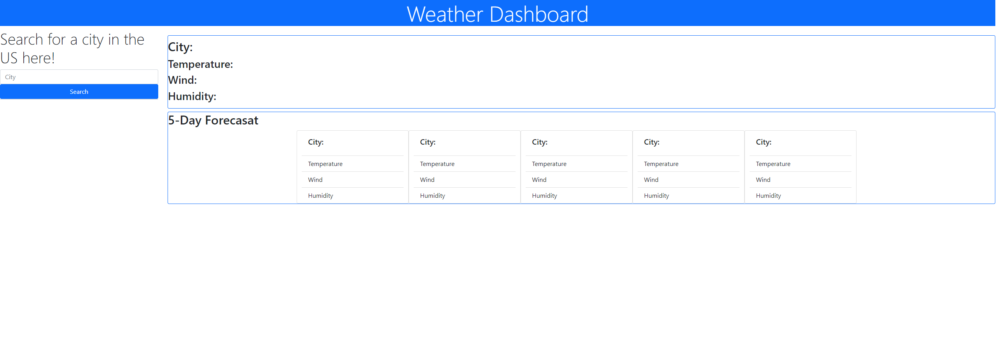

# Weather-Dashboard

## Description
As a user, I needed an application that allowed me to type in a city that allowed me to see the current weather and a 24 hour forecast. This application solves just that problem. Searching for any city within the United States will provide the current weather and a 24 hour forecast.

## Usage

Visit the website via this url:https://alexanderbarlow.github.io/weather-dashboard/
Visit the Github repo via this url:https://github.com/AlexanderBarlow/weather-dashboard
Type desired city in the search bar and the weather will be outputted.

## Features

This application pulls data from a weather api with is incorported with user input to dislay the data.

